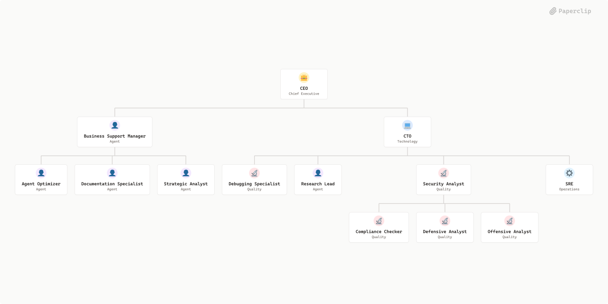

# AI_Security



## What's Inside

> This is an [Agent Company](https://agentcompanies.io) package from [Paperclip](https://paperclip.ing)

| Content | Count |
|---------|-------|
| Agents | 13 |
| Projects | 1 |
| Skills | 4 |
| Tasks | 1 |

### Agents

| Agent | Role | Reports To |
|-------|------|------------|
| Agent Optimizer | general | business-support-manager |
| Business Support Manager | pm | ceo |
| CEO | CEO | — |
| Compliance Checker | qa | security-analyst |
| CTO | CTO | ceo |
| Debugging Specialist | qa | cto |
| Defensive Analyst | qa | security-analyst |
| Documentation Specialist | general | business-support-manager |
| Offensive Analyst | qa | security-analyst |
| Research Lead | researcher | cto |
| Security Analyst | qa | cto |
| SRE | devops | cto |
| Strategic Analyst | researcher | business-support-manager |

### Projects

- **Onboarding**

### Skills

| Skill | Description | Source |
|-------|-------------|--------|
| paperclip-create-agent | > | [github](https://github.com/paperclipai/paperclip/tree/master/skills/paperclip-create-agent) |
| paperclip-create-plugin | > | [github](https://github.com/paperclipai/paperclip/tree/master/skills/paperclip-create-plugin) |
| paperclip | > | [github](https://github.com/paperclipai/paperclip/tree/master/skills/paperclip) |
| para-memory-files | > | [github](https://github.com/paperclipai/paperclip/tree/master/skills/para-memory-files) |

## Getting Started

```bash
pnpm paperclipai company import this-github-url-or-folder
```

See [Paperclip](https://paperclip.ing) for more information.

---
Exported from [Paperclip](https://paperclip.ing) on 2026-06-10
