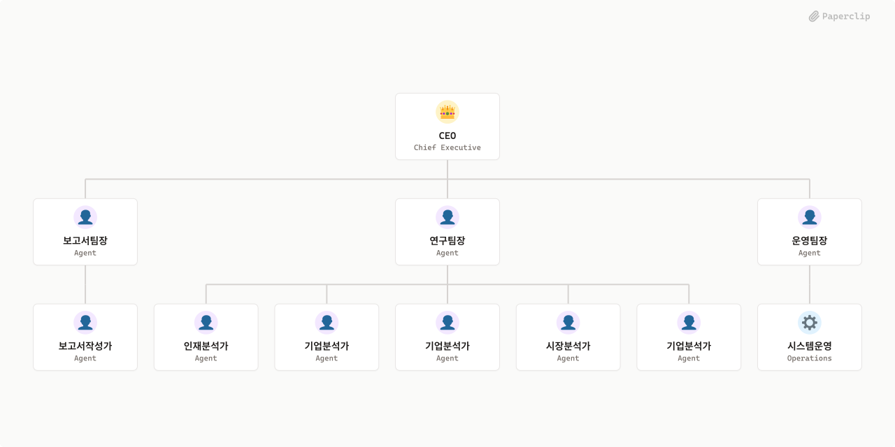

# Analyze_Company



## What's Inside

> This is an [Agent Company](https://agentcompanies.io) package from [Paperclip](https://paperclip.ing)

| Content | Count |
|---------|-------|
| Agents | 11 |
| Projects | 1 |
| Skills | 4 |

### Agents

| Agent | Role | Reports To |
|-------|------|------------|
| 인재분석가 | researcher | agent-8 |
| 기업분석가 | researcher | agent-8 |
| 기업분석가 | researcher | agent-8 |
| 보고서작성가 | researcher | agent-5 |
| 보고서팀장 | pm | ceo |
| 시스템운영 | devops | agent-9 |
| 시장분석가 | researcher | agent-8 |
| 연구팀장 | researcher | ceo |
| 운영팀장 | general | ceo |
| 기업분석가 | researcher | agent-8 |
| CEO | CEO | — |

### Projects

- **Onboarding**

### Skills

| Skill | Description | Source |
|-------|-------------|--------|
| paperclip-create-agent | > | [github](https://github.com/paperclipai/paperclip/tree/master/skills/paperclip-create-agent) |
| paperclip-create-plugin | > | [github](https://github.com/paperclipai/paperclip/tree/master/skills/paperclip-create-plugin) |
| paperclip | > | [github](https://github.com/paperclipai/paperclip/tree/master/skills/paperclip) |
| para-memory-files | > | [github](https://github.com/paperclipai/paperclip/tree/master/skills/para-memory-files) |

## Getting Started

```bash
pnpm paperclipai company import this-github-url-or-folder
```

See [Paperclip](https://paperclip.ing) for more information.

---
Exported from [Paperclip](https://paperclip.ing) on 2026-06-10
