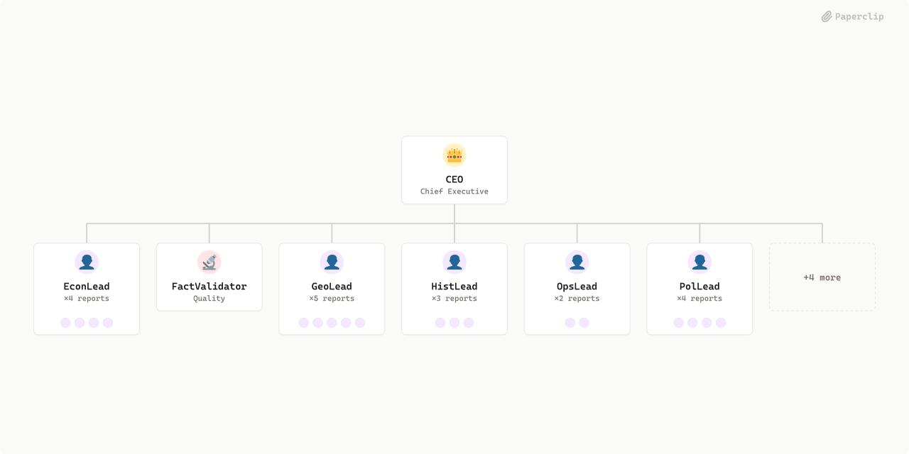

# Think_TANK



## What's Inside

> This is an [Agent Company](https://agentcompanies.io) package from [Paperclip](https://paperclip.ing)

| Content | Count |
|---------|-------|
| Agents | 29 |
| Projects | 1 |
| Skills | 4 |

### Agents

| Agent | Role | Reports To |
|-------|------|------------|
| CEO | CEO | — |
| EconAdvocate | general | econlead |
| EconAnalyst | general | econlead |
| EconCollector | researcher | econlead |
| EconLead | general | ceo |
| EconSkeptic | general | econlead |
| FactValidator | qa | ceo |
| GeoAdvocate | researcher | geolead |
| GeoAnalyst | researcher | geolead |
| GeoCollector | researcher | geolead |
| GeoIRAnalyst | researcher | geolead |
| GeoLead | general | ceo |
| GeoSkeptic | researcher | geolead |
| HistAnalyst | researcher | histlead |
| HistCollector | researcher | histlead |
| HistLead | general | ceo |
| HistResearcher | researcher | histlead |
| OpsLead | general | ceo |
| PolAdvocate | researcher | pollead |
| PolAnalyst | researcher | pollead |
| PolCollector | researcher | pollead |
| PolLead | general | ceo |
| PolSkeptic | researcher | pollead |
| QuantAnalyst | researcher | ceo |
| ReportWriter | general | ceo |
| ResearchLead | researcher | ceo |
| TelemetryAnalyst | researcher | opslead |
| WorkflowAnalyst | pm | opslead |
| WorkflowSupervisor | qa | ceo |

### Projects

- **Onboarding**

### Skills

| Skill | Description | Source |
|-------|-------------|--------|
| paperclip-create-agent | > | [github](https://github.com/paperclipai/paperclip/tree/master/skills/paperclip-create-agent) |
| paperclip-create-plugin | > | [github](https://github.com/paperclipai/paperclip/tree/master/skills/paperclip-create-plugin) |
| paperclip | > | [github](https://github.com/paperclipai/paperclip/tree/master/skills/paperclip) |
| para-memory-files | > | [github](https://github.com/paperclipai/paperclip/tree/master/skills/para-memory-files) |

## Getting Started

```bash
pnpm paperclipai company import this-github-url-or-folder
```

See [Paperclip](https://paperclip.ing) for more information.

---
Exported from [Paperclip](https://paperclip.ing) on 2026-06-10
